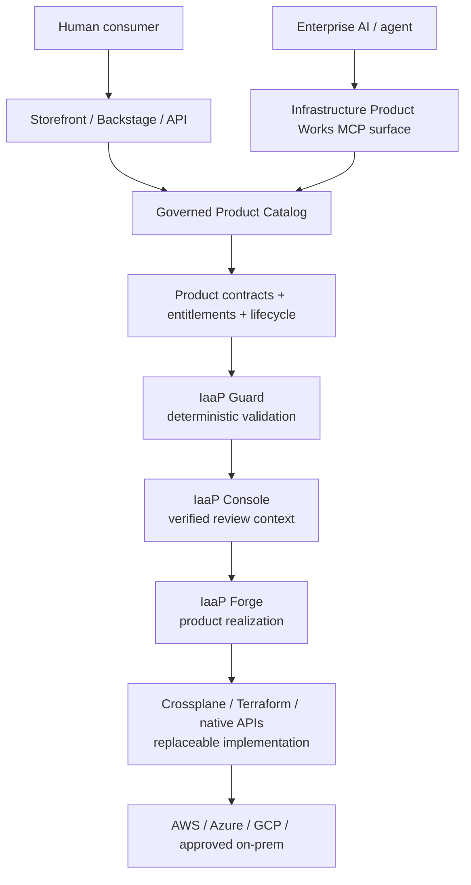
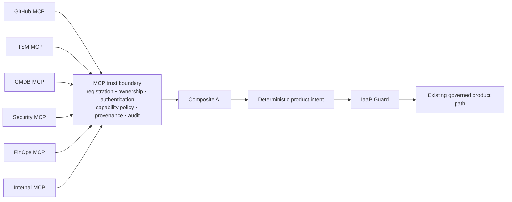

# Governed Agentic Interoperability

**Status:** Documentation-first architecture position  
**Portfolio posture:** `CONTINUE_VALIDATION`  
**Scope:** MCP and future agent interoperability protocols  
**Authority:** No infrastructure, approval, deployment, provisioning, credential, or production authority is granted by this document.

## Why this exists

Infrastructure Product Works uses Composite AI to help interpret intent, propose bounded changes, explain policy, diagnose sanitized state, and assemble evidence. Enterprise agents also need a standard way to discover governed infrastructure products and to consume approved enterprise context.

Model Context Protocol (MCP) is treated as an **interoperability protocol**, not as an infrastructure control plane and not as an authority boundary.

The durable capability is **Governed Agentic Interoperability**. MCP is the first protocol addressed by that capability.

## Canonical principle

> **One governed product system. Multiple consumption surfaces.** Humans discover and order governed products through Storefront, Backstage, APIs, or other approved experiences. Agents discover the same governed products through an MCP-compatible agent surface. Both use the same product contracts, entitlements, lifecycle rules, security baselines, and evidence. Neither surface bypasses deterministic validation, authorization, or governed fulfillment.

This means Infrastructure Product Works does **not** expose Crossplane compositions, Terraform modules, provider resources, or other implementation objects as the consumer-facing product model.

## Two MCP directions

### 1. Infrastructure Product Works as an MCP consumer

Customer-controlled MCP servers may provide approved context or bounded tools to Composite AI, for example:

- GitHub and source-control context;
- CMDB and service ownership data;
- ITSM records;
- security-control catalogs;
- FinOps and cost classifications;
- internal architecture standards;
- observability and operational metadata; and
- other enterprise systems approved by the customer.

These servers remain customer-owned integrations. Infrastructure Product Works governs how they participate.

### 2. Infrastructure Product Works as an MCP server

A future Infrastructure Product Works MCP surface may expose governed, bounded portfolio capabilities to enterprise agents, beginning with read-only discovery such as:

- `list_products()`;
- `search_products()`;
- `get_product()`;
- `get_product_version()`;
- `get_product_requirements()`;
- `check_entitlement()`;
- `get_product_evidence()`; and
- `get_lifecycle_status()`.

The MCP surface discovers **governed products**, not Crossplane objects.

Later bounded request-oriented operations may be considered, such as preparing a draft intent or requesting an assessment. Direct infrastructure operations remain out of scope.

## Product discovery boundary



The human and agent surfaces converge on the same governed product model.

## BYO-MCP trust boundary



Customer MCP connectivity does not confer infrastructure authority.

## Hard authority rules

The following paths are prohibited by architecture unless a future separately governed capability explicitly replaces this boundary:

```text
MCP -> Crossplane admin                 DENY
MCP -> Terraform apply                  DENY
MCP -> provider privileged API          DENY
MCP -> IAM modification                 DENY
MCP -> direct infrastructure provision  DENY
MCP -> self-approval                     DENY
```

Allowed or policy-controlled use is instead:

```text
MCP -> Composite AI context             POLICY CONTROLLED
MCP -> governed product discovery       ENTITLEMENT CONTROLLED
MCP -> evidence retrieval               POLICY CONTROLLED
MCP -> bounded request preparation      FUTURE / GOVERNED
```

Any MCP-derived context that materially influences an infrastructure-product decision must be treated as input, carry source/provenance metadata when required, and cross the same deterministic product, evidence, and authority boundaries as equivalent human-supplied context.

## Governed product discovery model

The agent surface should return consumer-relevant product information rather than implementation topology. A governed product may expose fields such as:

```text
GovernedProduct
  productId
  version
  lifecycleStatus
  capabilities
  supportedClouds
  securityBaseline
  networkProfiles
  entitlementRequirements
  costClassification
  inputContract
  evidenceRequirements
  fulfillmentBinding   # internal/abstracted from the consumer
```

`fulfillmentBinding` may resolve internally to Crossplane, Terraform, a native provider API, a workflow, or another supported implementation. The consumer contract does not depend on that choice.

## Productization precedes discovery

MCP does not make raw cloud services safe to consume.

The product hierarchy remains:

```text
Raw cloud capability
  -> security / architecture / platform / FinOps productization
  -> governed service product
  -> optional composition into a higher-order infrastructure product
  -> governed catalog
  -> human and agent discovery surfaces
  -> validation / review / realization / reconciliation
```

A cloud service must receive its required minimum security baseline, approved patterns, entitlements, cost boundaries, evidence requirements, lifecycle rules, and exception behavior before it becomes an approved product exposed to either humans or agents.

## Product ownership by repository

| Repository / surface | Responsibility |
|---|---|
| `ai-powered-infrastructure-as-a-product` | Canonical architecture, terminology, trust principles, public diagrams, and strategic position |
| `composite-ai-infrastructure-product-poc` | BYO-MCP client boundary for Composite AI; provider-neutral context/tool consumption |
| `iaap-guard` | Deterministic trust, provenance, authority-denial, and evidence requirements for MCP-derived context |
| `iaap-console` | Future registration, trust configuration, ownership, capability policy, and review experience for customer MCP servers |
| `iaap-forge` | Governed-product discovery schema and implementation-independent fulfillment binding |
| `backstage-infrastructure-product-storefront-poc` | Human consumption surface and same-catalog parity with future agent discovery |
| `iaap-assurance` | Authority/custody continuity when agentic context or requests participate in governed decisions |
| `multicloud-foundation-poc-integration` | Cross-product compatibility, evidence, negative testing, and roadmap reconciliation |
| public website | Customer-facing explanation of governed products, human/agent consumption, BYO-MCP, security, entitlement, and authority boundaries |

## Documentation-first implementation order

1. **Architecture reconciliation** — establish the common catalog and agentic trust principles across public documentation and diagrams.
2. **Repository responsibility reconciliation** — document Guard, Console, Forge, Composite AI, Storefront, Assurance, and Integration boundaries.
3. **Artifact drift sweep** — classify existing architecture visuals and text as KEEP, UPDATE, REPLACE, or RETIRE where they conflict with the canonical model.
4. **Common governed-product discovery contract** — establish a single product representation usable by Storefront and future MCP discovery.
5. **Read-only Infrastructure Product Works MCP surface** — expose governed product discovery and evidence retrieval only.
6. **BYO-MCP support for Composite AI** — begin with read-only/context-oriented customer MCP servers and explicit trust policy.
7. **Console governance administration** — register and manage approved MCP servers, owners, capabilities, environments, and evidence requirements.
8. **Restricted-network/self-hosted MCP portability** — align with customer-controlled enterprise deployment and EP-08 portability requirements.
9. **Later bounded requests** — consider request/draft operations only after evidence demonstrates they do not bypass existing authority boundaries.

## Roadmap relationship

This documentation tranche does **not** create a new Objective, Key Result, Epic, or primary Feature count by itself.

The capability is reconciled against existing portfolio work:

- **EP-07 — Product Distribution and Adoption Surfaces:** the future IPW MCP surface is an additional agent consumption/adoption surface over the same governed product system. It must not reopen already accepted EP-07 closure claims until implementation actually begins.
- **EP-08 — GitHub Enterprise Server and restricted-network portability:** customer-controlled and restricted-network MCP operation belongs with the portability requirement and must not assume public SaaS, public egress, or vendor-hosted MCP infrastructure.
- **Composite AI:** BYO-MCP is an input/tool interoperability mechanism for bounded intelligence, not an expansion of AI authority.
- **Guard / Assurance:** MCP participation must preserve deterministic validation, provenance, custody, and authority attenuation.

A later roadmap feature reconciliation may assign stable IDs before implementation begins. Until then, this document records architecture intent only and preserves the current 5-Objective, 47-KR, 15-Epic, 116-feature baseline.

## Canonical wording for public surfaces

Use these statements consistently:

> **One governed product system. Multiple consumption surfaces.**

> **Storefront is the human product experience. MCP is the agent discovery surface. Both consume the same governed product catalog.**

> **MCP is an interoperability protocol, not an infrastructure authority boundary.**

> **Infrastructure Product Works discovers governed products, not Crossplane objects.**

> **Customer MCPs may inform Composite AI, but infrastructure-changing intent must cross the existing deterministic contract, validation, entitlement, evidence, authorization, and fulfillment boundaries.**

## Current claim boundary

This is documentation-first architecture. It does not claim that an Infrastructure Product Works MCP server, MCP client, MCP registry, MCP trust engine, agent entitlement service, or production MCP integration is currently implemented. Existing legacy execution-MCP references in historical accelerator material remain superseded; they must not be interpreted as the governed MCP model defined here.
