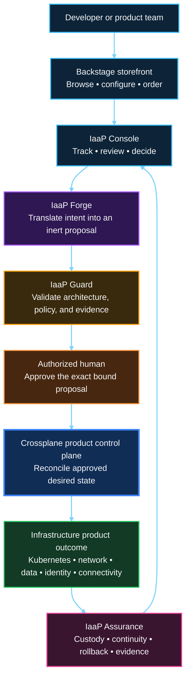
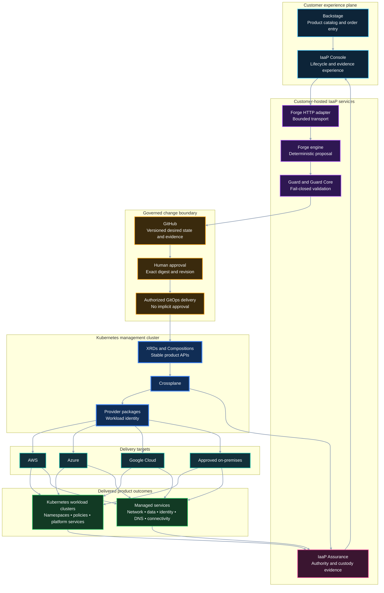
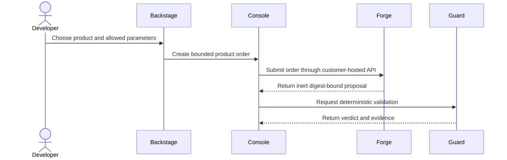
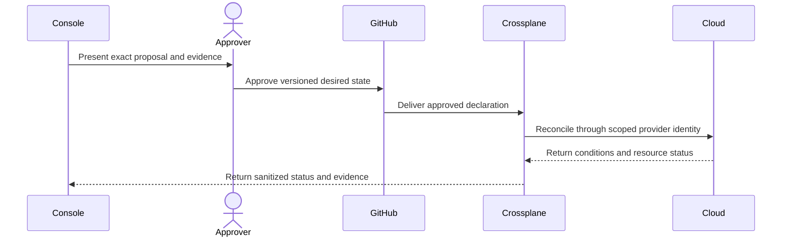

# Product and runtime architecture

This is the authoritative end-to-end view of the Infrastructure Product Works™ Infrastructure-as-a-Product portfolio. It separates the **product experience** from the **runtime implementation** so developers can order outcomes without inheriting cloud, Kubernetes, or provider complexity.

> [!IMPORTANT]
> This is the target operating model. Current portfolio evidence remains bounded and synthetic. IaaP Guard is the supported GitHub-native product; the bounded customer-hosted Forge HTTP transport was accepted through Forge PR #96 and merged to protected `main` at `fd6452fcb7e4934695b8ed73657daf98c4f0bc28`. Direct Backstage → Console → Forge → Crossplane production execution, credentials, customer data, pilot authority, and commercial activation are not claimed here.

## Product view

The developer orders an **outcome**, not a collection of provider resources. Backstage presents the catalog. Console presents the lifecycle. Forge proposes the implementation. Guard determines whether the proposal is admissible. An authorized person controls the material decision. Crossplane performs reconciliation only after the approved desired state crosses the execution boundary. Assurance keeps the evidence and custody chain intact.

## Technical deployment and reconciliation view

### Why Kubernetes appears twice

Kubernetes has two distinct roles in this architecture:

1. The **management cluster** hosts Crossplane and its product APIs. Crossplane watches approved claims and reconciles them through provider packages.
2. A **workload cluster** may be one of the infrastructure products delivered by Crossplane. It is a destination, not the place where a developer directly operates the management control plane.

Crossplane can also deliver managed services that do not run inside Kubernetes, including networks, databases, storage, identities, DNS, encryption resources, and managed connectivity.

## Authority and responsibility

| Component | Owns | Does not own |
|---|---|---|
| Backstage | Product discovery, permitted configuration, order entry | Cloud or Kubernetes provisioning |
| IaaP Console | Order state, proposal and evidence presentation, human workflow | Forge logic, Guard verdicts, silent approval, or reconciliation |
| IaaP Forge | Deterministic product proposals and lifecycle artifacts | Approval, cloud credentials, apply, or provisioning |
| IaaP Guard | Deterministic architecture, policy, authority, and evidence validation | Human authorization or infrastructure execution |
| GitHub and GitOps | Versioned change, review record, approved desired-state delivery | Product definition or hidden policy bypass |
| Authorized human | Acceptance or rejection of the exact material change | Undocumented override of deterministic gates |
| Crossplane | Continuous desired-state reconciliation and lifecycle status | Storefront experience, business approval, or product selection |
| Kubernetes management cluster | Runtime for the Crossplane control plane | Automatic authority to administer workload environments |
| Cloud-native IAM and controls | Final technical enforcement | Redefinition of the consumer product contract |
| IaaP Assurance | Authority, custody, safeguard continuity, rollback, and evidence chain | Storefront, proposal generation, or cloud provisioning |

## Order-to-outcome sequence

### Plan and authorize

### Approve, reconcile, and report

## Implementation status boundary

| Capability | Current portfolio position |
|---|---|
| Backstage product ordering | Bounded POC with runtime dry-run evidence; no infrastructure apply authority |
| Console | Customer-hosted synthetic visibility and evidence projections; non-authoritative |
| Forge | Deterministic proposal engine with bounded loopback-only customer-hosted HTTP parity accepted through PR #96; no deployment authority |
| Guard | Supported GitHub-native deterministic architecture and evidence check |
| Crossplane | Credential-free contracts, bundles, simulations, and bounded reconciliation evidence |
| Live end-to-end provisioning | Separately governed target; not authorized or claimed by this diagram |

The stable center is the **infrastructure product contract**. Backstage, Console, GitHub workflows, models, providers, and individual cloud implementations may evolve without forcing developers to relearn how to order the outcome.
