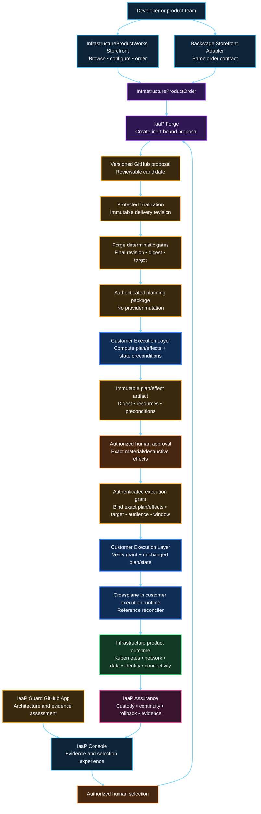
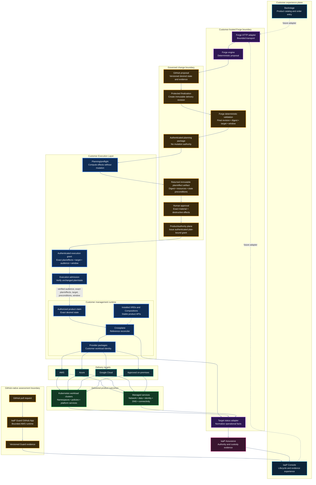
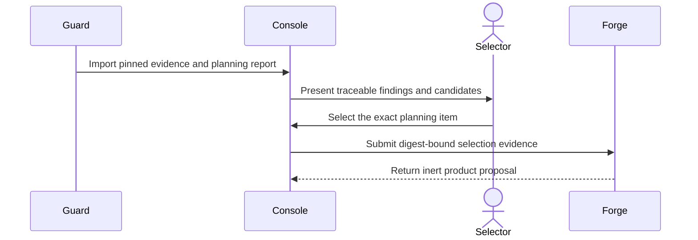
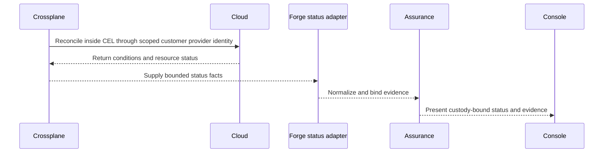

# Product and runtime architecture

This is the authoritative end-to-end view of the Infrastructure Product Works™ Infrastructure-as-a-Product portfolio. It separates the **product experience** from the **runtime implementation** so developers can order outcomes without inheriting cloud, Kubernetes, or provider complexity.

> [!IMPORTANT]
> This is the target operating model. Current portfolio evidence remains bounded. IaaP Guard is the supported GitHub-native product. The [September 11 Storefront evidence](evidence/storefront-drive-thru-2026-09-11.md) pins first-class Storefront `0.2.0` and Backstage Storefront Adapter `0.1.1` as bounded experience surfaces; it does not authorize authenticated downstream transport, pilot, or production operation. Forge remains bounded, and direct Storefront/Backstage → Console → Forge → Crossplane production execution, credentials, customer data, pilot authority, and commercial activation are not claimed here.

## Product view



The developer orders an **outcome**, not a collection of provider resources. The first-class Storefront captures product intent; the Backstage Storefront Adapter can capture the same intent through the same closed order contract. Separately, Guard produces architecture and planning evidence through its supported GitHub-native boundary; Console presents that evidence for human selection. Forge consumes the order and accepted selection to create an inert proposal. That proposal is finalized through the protected GitHub path into an immutable delivery revision before approval. Forge’s deterministic gates validate the final revision and desired-state binding. The Customer Execution Layer then performs a no-write plan phase so exact effects and provider-state preconditions can be bound. An authorized person approves the material decision and any required destructive effects; the product/authority plane issues an authenticated execution grant for the exact plan/effect digest, target, audience, and window. The CEL verifies that grant before handing the exact saved plan or unchanged effect set to the selected reconciler. There is no content-changing merge or effect-changing re-plan after authorization. Any change to content, plan/effect digest, affected resources, provider-state preconditions, target, audience, or window invalidates the grant and restarts the gate. Assurance keeps the authority and custody chain intact.

## Technical deployment and reconciliation view



### Why Kubernetes appears twice

Kubernetes has two distinct roles in this architecture:

1. The **customer management runtime** sits inside the Customer Execution Layer and hosts Crossplane when Crossplane is selected. A write-capable claim is admitted only for the finite execution session covered by an authenticated, plan-bound execution grant. Once those exact effects complete, fail, expire, or are revoked, the CEL suspends/blocks provider writes for that claim/identity. Crossplane may continue read-only observation/drift detection, but every later corrective write must return through planning, current-state preconditions, human/destructive authorization as applicable, and a fresh execution grant.
2. A **workload cluster** may be one of the infrastructure products delivered by Crossplane. It is a destination, not the place where a developer directly operates the management control plane.

Crossplane can also deliver managed services that do not run inside Kubernetes, including networks, databases, storage, identities, DNS, encryption resources, and managed connectivity.

## Authority and responsibility

| Component | Owns | Does not own |
|---|---|---|
| Backstage | Product discovery, permitted configuration, order entry | Cloud or Kubernetes provisioning |
| IaaP Console | Order state, proposal and evidence presentation, human workflow | Forge logic, Guard verdicts, silent approval, or reconciliation |
| IaaP Forge | Deterministic product proposals and lifecycle artifacts | Approval, cloud credentials, apply, or provisioning |
| IaaP Guard | Deterministic architecture, policy, authority, and evidence validation | Human authorization or infrastructure execution |
| GitHub / product authority plane | Versioned change, review record, authenticated execution-package/grant provenance | Provider credentials, direct cloud mutation, or hidden policy bypass |
| Authorized human | Acceptance or rejection of the exact material change and separately required destructive effects | Undocumented override of deterministic gates |
| Customer Execution Layer | Verify package/grant issuer, audience, target, exact plan/effects, provider-state preconditions, replay/expiry and destructive authority | Consumer intent, self-approval, or silent re-plan widening |
| Crossplane | Reference reconciliation engine inside the CEL and lifecycle/status observation | Storefront experience, business approval, product selection, perpetual write authority, or any mutation beyond the current finite execution grant |
| Customer management runtime | Runtime for the selected CEL execution engine | Automatic or standing authority to administer workload environments outside the current admitted target/effects/session |
| Cloud-native IAM and controls | Final technical enforcement | Redefinition of the consumer product contract |
| IaaP Assurance | Authority, custody, safeguard continuity, rollback, and evidence chain | Storefront, proposal generation, or cloud provisioning |

## Order-to-outcome sequence

### Accepted synthetic Guard-to-Forge chain



### Target authorization and delivery handoff

```mermaid
sequenceDiagram
  participant ForgeGate as Forge validation
  actor Approver
  participant GitHub
  participant CEL
  participant Crossplane

  GitHub->>GitHub: Protected finalization creates desired-state revision
  GitHub->>ForgeGate: Present exact revision and target
  ForgeGate-->>GitHub: Bind passing validation to desired state
  GitHub->>CEL: Authenticated planning package (no mutation)
  CEL->>CEL: Compute immutable plan/effects + provider-state preconditions
  CEL-->>GitHub: Return planned-effect digest
  Approver->>GitHub: Approve exact material/destructive effects
  GitHub->>CEL: Issue audience-bound execution grant for exact plan/effects
  CEL->>CEL: Verify issuer, audience, state preconditions, expiry/replay
  CEL->>Crossplane: Admit exact saved/unchanged authorized effects for finite write session
  Crossplane-->>CEL: Authorized effects converge or terminate
  CEL->>Crossplane: Suspend provider writes; retain read-only observation
  Note over CEL,Crossplane: Any later drift-driven write requires a fresh plan and execution grant
```

### Target runtime evidence return



## Implementation status boundary

| Capability | Current portfolio position |
|---|---|
| Backstage product ordering | Bounded POC with runtime dry-run evidence; no infrastructure apply authority |
| Console | Customer-hosted synthetic visibility and evidence projections; non-authoritative |
| Forge | Deterministic proposal engine with an installable loopback-only nonproduction HTTP preview; no network-exposed service, client adapter, or deployment authority is claimed |
| Guard | Supported GitHub-native deterministic architecture and evidence check |
| Crossplane | Credential-free contracts, bundles, simulations, and bounded reconciliation evidence |
| Live end-to-end provisioning | Separately governed target; not authorized or claimed by this diagram |

The stable center is the **infrastructure product contract**. Backstage, Console, GitHub workflows, models, providers, and individual cloud implementations may evolve without forcing developers to relearn how to order the outcome.
