# Customer Execution Layer

**Date:** September 19, 2026  
**Status:** documentation-first architecture target  
**Authority:** architecture and acceptance planning only; no customer credentials, live provider mutation, production authority, or authorization claim is created by this document.

## Decision

Infrastructure Product Works separates **governed infrastructure-product intent** from **provider mutation authority**.

IPW products may prepare, validate, authorize, and evidence an exact desired state. A separately deployed **Customer Execution Layer (CEL)** is the sole IPW execution-authorization gateway for provider mutation.

For customer-hosted engines, the CEL and its local adapter perform the provider call. If a customer deliberately selects a hosted execution service that can itself perform provider mutation, that service is modeled as a separate **External Execution Authority** downstream of the CEL with its own identity, credential, network, data-handling, evidence, and revocation boundary. It is never treated as though it were merely an internal CEL library.

The CEL is customer-controlled. IPW does not require a shared multi-customer AWS, Azure, or Google Cloud credential store.

## Why the layer exists

The product system answers:

- what product was requested;
- which exact version/configuration is proposed;
- which policy and control profile applies;
- what evidence supports the proposal;
- who authorized the exact action; and
- what immutable execution package may proceed.

The Customer Execution Layer answers:

- which customer cloud target is permitted;
- which short-lived workload identity is used;
- which execution adapter owns the operation;
- which provider APIs are called;
- what provider state was actually observed;
- whether reconciliation succeeded, failed, drifted, or was rolled back; and
- what execution evidence is returned to IPW.

Keeping those concerns separate prevents the Storefront, AI, Console, Guard, Forge, or Assurance surfaces from becoming cloud super-admins.

## Logical architecture

```mermaid
flowchart LR
  SF[Storefront / API] --> FG[Forge]
  FG --> GD[Guard]
  GD --> HR[Human authorization]
  HR --> AS[Assurance verification]
  AS --> PKG[Digest-bound execution package]

  PKG --> CEL[Customer Execution Layer]
  CEL --> POL[Execution policy + preflight]
  POL --> ENG[Approved execution engine]

  ENG --> AWSA[AWS adapter]
  ENG --> AZA[Azure adapter]
  ENG --> GCPA[GCP adapter]

  AWSA --> AWS[AWS / AWS GovCloud APIs]
  AZA --> AZ[Azure / Azure Government APIs]
  GCPA --> GCP[Google Cloud APIs]

  AWS --> OBS[Observed status + evidence]
  AZ --> OBS
  GCP --> OBS
  OBS --> AS
  OBS --> CO[Console / operations]

  classDef product fill:#0D2438,stroke:#38BDF8,stroke-width:2px,color:#F8FAFC
  classDef authority fill:#3A2A0D,stroke:#F59E0B,stroke-width:2px,color:#F8FAFC
  classDef execution fill:#2E1752,stroke:#A855F7,stroke-width:2px,color:#F8FAFC
  classDef cloud fill:#123A24,stroke:#22C55E,stroke-width:2px,color:#F8FAFC
  class SF,FG,GD,AS,CO product
  class HR,PKG,POL authority
  class CEL,ENG,AWSA,AZA,GCPA execution
  class AWS,AZ,GCP,OBS cloud
```

## Execution-package boundary

A CEL operation must consume an immutable, versioned execution package. The package is not a raw shell command, Terraform plan, Kubernetes manifest, or provider credential supplied by the consumer.

At minimum the package binds:

- schema/version;
- trusted issuer identity and issuer key/attestation reference;
- intended CEL audience / deployment identity;
- package issuance identifier and authenticity mechanism;
- customer/tenant scope;
- product identifier and version;
- product/request revision;
- desired-state digest;
- Guard assessment/profile reference and digest;
- human decision reference, decision digest, decision issuer/approver provenance, and decision authority scope;
- Assurance verification reference and provenance;
- FoundationTarget reference;
- approved execution-adapter identity/version;
- allowed operation;
- planning authorization scope;
- final execution-grant reference when mutation is permitted;
- planned-effect digest and affected-resource set for write-capable execution;
- provider-state precondition/version references used to compute the authorized effects;
- destructive-authorization reference when applicable;
- authorization issue time and expiration;
- idempotency/replay identity;
- rollback/retirement policy reference; and
- evidence destination/profile reference.

The executor must fail closed if any required binding is missing, stale, unsupported, altered, unauthenticated, or inconsistent with the target environment.

A digest proves content integrity only. It does **not** prove who issued or authorized the package. Before mutation, the CEL must authenticate the package issuer with a customer-approved signature, attestation, or equivalent authenticity mechanism; verify that the package audience identifies this CEL deployment; and verify that the human decision/provenance came from a trusted authority path. A self-consistent package created by an untrusted caller is never sufficient execution authority.

## Customer-controlled identity

The CEL must prefer **short-lived workload identity** over static credentials.

Reference patterns include:

- AWS: EKS Pod Identity or another approved temporary-role/federation mechanism;
- Azure: Microsoft Entra workload identity federation / managed identity;
- Google Cloud: Workload Identity Federation, including Workload Identity Federation for GKE where appropriate.

Long-lived AWS access keys, Azure client secrets, Google service-account keys, or equivalent static credentials are prohibited by the default CEL security profile.

A provider-specific exception, if ever permitted, requires an explicit customer risk decision, separately documented secret custody, rotation, revocation, audit, and expiration controls. It is not the default design.

## Execution-engine boundary

Crossplane is the reference reconciler for the current architecture, not the infrastructure product itself.

The CEL may support one approved execution engine per owned resource, including:

- customer-hosted Crossplane / Upbound;
- customer-hosted Terraform / OpenTofu;
- customer-hosted Terraform Enterprise or a customer-controlled Terraform agent/runtime;
- provider-native account/project/subscription vending;
- provider-native declarative orchestration; or
- another separately accepted adapter.

Hosted services such as HCP Terraform or an Upbound-managed control plane require one of two explicit patterns:

1. **customer-hosted execution agent/runtime:** provider credentials and provider API calls terminate inside the customer's approved boundary while the hosted service supplies orchestration metadata; or
2. **External Execution Authority:** the hosted service receives effective provider authority or can directly cause provider mutation. It must then be modeled as a separate trust zone with separately approved credential custody, network paths, data handling, least privilege, audit, retention, failure semantics, revocation, and evidence.

The CEL remains the sole IPW gateway that may authorize either pattern, but a hosted service with provider authority is not represented as though it were inside the CEL.

### External Execution Authority delegation

The original CEL-audience package must never be forwarded as though it were valid authority for an External Execution Authority (EEA).

When an EEA is selected, the CEL must issue a separately authenticated, narrowly scoped **execution delegation grant** whose audience is the exact EEA identity. The grant must bind at least:

- CEL issuer identity and signing/attestation provenance;
- exact EEA audience/identity;
- parent execution-package and execution-grant digests;
- customer/tenant and FoundationTarget;
- exact saved-plan or planned-effect digest;
- affected-resource identities and destructive classifications;
- provider-state preconditions/version references;
- permitted effects only;
- credential/identity mode;
- issue time, expiry, replay/idempotency identity, and revocation epoch/state;
- required evidence-return schema/destination; and
- the CEL identity/audience permitted to accept the returned execution evidence.

The EEA must authenticate this delegation grant before mutation and fail closed on audience mismatch, expired/revoked grant, plan/effect mismatch, changed provider state, replay, or unsupported authority. A normal hosted-service job/API request is transport only and is never sufficient authority without this grant.

Exactly one engine is authoritative for each external resource. Observation by another tool does not confer management authority.

An engine change requires an explicit ownership-transfer plan, state/evidence reconciliation, rollback criteria, and customer approval.

## FoundationTarget binding

Every write-capable operation is bound to one approved `FoundationTarget`.

The target identifies the permitted provider boundary:

- AWS account / organization relationship;
- Azure subscription / tenant / management-group relationship; or
- Google Cloud project / organization / folder relationship.

The CEL may not widen the target merely because its underlying provider identity technically has broader permissions.

Effective permissions must be checked against both:

1. the cloud-native identity policy; and
2. the IPW execution package's authorized scope.

The narrower result wins.

## Two-phase plan and execution authorization

A desired-state authorization is not sufficient by itself for a write-capable apply.

The CEL uses a two-phase protocol:

1. **Plan phase — no provider mutation.**
   - consume the authenticated desired-state package;
   - read only the provider state necessary to compute effects;
   - create an immutable plan/effect artifact;
   - bind the plan to the exact desired-state digest, FoundationTarget, provider-state preconditions/version references, adapter/engine version, affected-resource identities, effect classifications, and plan expiration;
   - compute a `plannedEffectDigest`; and
   - return the plan/effect artifact for authorization.

2. **Execution-grant phase.**
   - a trusted authorization path approves the exact plan/effect artifact;
   - destructive effects receive separate destructive authority;
   - the product/authority plane issues an authenticated execution grant binding the `plannedEffectDigest`, relevant provider-state preconditions, target, operation/effects, audience, expiry, and replay identity;
   - the CEL may mutate only while those exact bindings remain true.

Where the engine supports an immutable saved plan, the CEL must apply that exact saved plan. Where the engine cannot apply a saved plan, the CEL must recompute immediately before mutation and require the new effect digest and provider-state preconditions to match the authorized grant byte-for-byte/semantically as defined by the contract. Any drift, re-plan difference, changed affected resource, changed destructive classification, changed provider-state precondition, or expired plan invalidates the grant and returns to plan/review.

This prevents an authentic `UPDATE` request from silently becoming an unauthorized replacement after provider drift.

## Lifecycle operations

The CEL contract must distinguish at least:

- `CREATE_OR_RECONCILE`
- `OBSERVE`
- `UPDATE`
- `ROLLBACK`
- `DETACH_MANAGEMENT`
- `RETIRE`
- `DELETE`

Approval for one operation does not imply another.

The operation label alone is not enough to establish destructive authority. Before mutation, the selected engine/adapter must produce or expose a bounded **planned-effect set** for the exact desired-state revision. The CEL classifies effects at least as create, observe, in-place update, detach, replace/recreate, and destroy.

Any planned effect that destroys an existing resource, replaces/recreates it, performs an irreversible data-loss action, or otherwise removes an existing protected capability is **destructive** even when the outer request is labeled `UPDATE`, `ROLLBACK`, or `CREATE_OR_RECONCILE`.

Destructive effects require a separately bound destructive/delete decision that covers the exact resource/effect set and its digest. If the engine cannot determine whether an operation may destroy or replace a protected resource before applying it, the CEL fails closed and requires human review rather than treating the operation as an ordinary update.

## Preflight

Before any provider mutation, the CEL must verify:

1. executor and adapter version are accepted;
2. execution package integrity **and authenticity**;
3. trusted package issuer, intended CEL audience, issuance identity, and decision/approval provenance;
4. current time is inside the authorization window;
5. target identity matches the FoundationTarget;
6. provider/cloud partition or environment matches the approved profile;
7. region/location is permitted;
8. workload identity is the expected principal;
9. effective provider permissions do not exceed the accepted execution profile;
10. an immutable saved plan or equivalent planned-effect artifact exists for the exact desired-state revision;
11. the final authenticated execution grant binds the exact planned-effect digest, affected resources, and provider-state preconditions;
12. the current provider state still satisfies those authorized preconditions and any recomputed plan/effects are unchanged;
13. every destructive replace/destroy/irreversible effect has separate, exact destructive authority;
14. when an External Execution Authority is used, its audience-specific delegation grant is valid, unexpired, unreplayed, and not revoked;
15. required network, DNS, logging, encryption, evidence, cost, and security dependencies are available;
16. no competing authoritative reconciler is detected;
17. rollback/teardown path is available for the requested operation; and
18. the evidence sink is writable before the first mutation where the profile requires durable audit capture.

A failed preflight produces evidence and performs no cloud write.

## Kill switch

The customer must be able to revoke future IPW mutation authority without disabling already-running infrastructure.

At minimum, the customer can:

- revoke the executor workload-identity trust;
- remove or narrow the cloud role/permissions;
- disable the executor deployment;
- disable an individual provider/target profile; or
- expire/revoke the accepted execution authorization.

Existing infrastructure remains governed by its cloud-native runtime controls unless a separately authorized lifecycle action changes it.

This prevents IPW availability from becoming a prerequisite for application runtime availability.

## Network posture

The default CEL profile is outbound-oriented.

It must not require unsolicited public inbound access to the execution controller merely to perform provider reconciliation.

Customer profiles may require:

- private API endpoints;
- egress proxies;
- customer-managed DNS;
- private certificate authorities;
- managed inspection points;
- explicit destination allowlists;
- FIPS-capable endpoints;
- restricted-network mirrors; and
- disconnected/offline preparation where provider access is not yet authorized.

Connectivity proves only that an endpoint is reachable. It does not establish authority.

## Evidence returned by the executor

A completed attempt should retain or reference:

- exact execution-package digest;
- executor/adapter/engine versions;
- workload principal and target identity;
- authorization and change references;
- operation type, exact saved-plan/planned-effect digest, affected-resource set, and provider-state preconditions;
- final execution-grant digest;
- destructive-effect classification and separate destructive authorization reference where applicable;
- External Execution Authority delegation-grant digest and audience where applicable;
- authenticated package issuer, audience, and approval-provenance verification result;
- provider request/activity identifiers where safely retainable;
- resource identities in sanitized form;
- preflight result;
- provider reconciliation conditions;
- policy/denial results;
- start/end time;
- retry/attempt number;
- rollback/teardown status;
- residual-resource query where applicable;
- observed final state; and
- evidence digest.

Sensitive credentials, raw tokens, private keys, or unnecessary protected/customer data are never part of portable evidence.

## Isolation

A multi-customer deployment must keep separate:

- workload identities;
- target profiles;
- authorization records;
- queues;
- execution state;
- evidence destinations;
- network routes/endpoints; and
- retry/idempotency domains.

A customer identifier in an application payload alone is not sufficient isolation.

## Failure semantics

The executor must make partial failure explicit.

It may not translate:

- API timeout into success;
- provider acceptance into resource readiness;
- missing audit evidence into verified completion;
- partial rollback into clean teardown; or
- stale observed state into current state.

A failed or ambiguous operation remains bounded for operator review and cannot silently widen permissions to recover.

## Government Security Profile

A CEL may apply the separately defined [Government Security Profile](../bootstrap-foundation-readiness/security/government-security-profile.md).

That profile adds federal-oriented requirements for identity, least privilege, separation of duties, boundary protection, cryptography, audit/evidence, configuration integrity, government cloud/environment semantics, supply chain, and assessor-ready traceability.

The profile is a design and validation contract. It is not itself a FedRAMP authorization, FISMA authorization, ATO, cATO, or agency acceptance decision.

## Current implementation status

Already demonstrated separately:

- credential-free provider adapter simulations;
- inert external-executor protocol;
- bounded non-production AWS, Azure, and GCP reconciliation;
- workload-identity patterns in all three providers;
- evidence capture and verified teardown for bounded sandbox slices.

Not yet implemented as one customer-operational capability:

- credentialed customer-hosted CEL;
- durable customer execution queue;
- production-grade identity/bootstrap;
- provider mutation package handoff from Assurance;
- government security-profile enforcement;
- customer pilot/production operation.

## Documentation-first acceptance

Before runtime CEL development is accepted, reviewers must be able to determine without inference:

1. exactly where cloud credentials/identity exist;
2. exactly which component can mutate provider resources;
3. how authorization is bound to immutable desired state;
4. how an operation is restricted to one customer and FoundationTarget;
5. how execution engines remain replaceable;
6. how a two-phase plan/authorize protocol binds exact effects and provider-state preconditions before any mutation;
7. how destroy/replace effects are detected and bound to separate destructive authority even when requested as update or rollback;
8. how package issuer, audience, and human-decision provenance are authenticated;
9. how external hosted execution authorities receive their own audience-bound delegation grants;
10. how external hosted execution authorities are modeled when provider credentials or mutation authority leave the customer-hosted runtime;
11. how the customer revokes future mutation authority;
12. how failures and partial state are represented;
13. what evidence returns to IPW; and
14. what additional constraints apply under the Government Security Profile.

## Non-goals

This architecture does not:

- make IPW a shared cloud super-admin;
- require Crossplane forever;
- grant cloud credentials to Storefront, Guard, Console, Composite AI, or ServiceNow;
- authorize production use;
- claim control implementation from architecture alone;
- replace customer IAM, network, logging, key-management, SIEM, CMDB, or incident-response systems; or
- imply that equivalent product names have equivalent cloud security semantics.
