# Customer Execution Layer

**Date:** September 19, 2026  
**Status:** documentation-first architecture target  
**Authority:** architecture and acceptance planning only; no customer credentials, live provider mutation, production authority, or authorization claim is created by this document.

## Decision

Infrastructure Product Works separates **governed infrastructure-product intent** from **provider mutation authority**.

IPW products may prepare, validate, authorize, and evidence an exact desired state. A separately deployed **Customer Execution Layer (CEL)** is the only component permitted to translate a verified execution package into customer-cloud API calls.

The CEL is customer-controlled. IPW does not require a shared multi-customer AWS, Azure, or Google Cloud credential store.

## Why the layer exists

The product system answers:

- what product was requested;
- which exact version/configuration is proposed;
- which policy and control profile applies;
- what evidence supports the proposal;
- who authorized the exact action; and
- what immutable execution package may proceed.

The Customer Execution Layer answers:

- which customer cloud target is permitted;
- which short-lived workload identity is used;
- which execution adapter owns the operation;
- which provider APIs are called;
- what provider state was actually observed;
- whether reconciliation succeeded, failed, drifted, or was rolled back; and
- what execution evidence is returned to IPW.

Keeping those concerns separate prevents the Storefront, AI, Console, Guard, Forge, or Assurance surfaces from becoming cloud super-admins.

## Logical architecture

```mermaid
flowchart LR
  SF[Storefront / API] --> FG[Forge]
  FG --> GD[Guard]
  GD --> HR[Human authorization]
  HR --> AS[Assurance verification]
  AS --> PKG[Digest-bound execution package]

  PKG --> CEL[Customer Execution Layer]
  CEL --> POL[Execution policy + preflight]
  POL --> ENG[Approved execution engine]

  ENG --> AWSA[AWS adapter]
  ENG --> AZA[Azure adapter]
  ENG --> GCPA[GCP adapter]

  AWSA --> AWS[AWS / AWS GovCloud APIs]
  AZA --> AZ[Azure / Azure Government APIs]
  GCPA --> GCP[Google Cloud APIs]

  AWS --> OBS[Observed status + evidence]
  AZ --> OBS
  GCP --> OBS
  OBS --> AS
  OBS --> CO[Console / operations]

  classDef product fill:#0D2438,stroke:#38BDF8,stroke-width:2px,color:#F8FAFC
  classDef authority fill:#3A2A0D,stroke:#F59E0B,stroke-width:2px,color:#F8FAFC
  classDef execution fill:#2E1752,stroke:#A855F7,stroke-width:2px,color:#F8FAFC
  classDef cloud fill:#123A24,stroke:#22C55E,stroke-width:2px,color:#F8FAFC
  class SF,FG,GD,AS,CO product
  class HR,PKG,POL authority
  class CEL,ENG,AWSA,AZA,GCPA execution
  class AWS,AZ,GCP,OBS cloud
```

## Execution-package boundary

A CEL operation must consume an immutable, versioned execution package. The package is not a raw shell command, Terraform plan, Kubernetes manifest, or provider credential supplied by the consumer.

At minimum the package binds:

- schema/version;
- customer/tenant scope;
- product identifier and version;
- product/request revision;
- desired-state digest;
- Guard assessment/profile reference and digest;
- human decision reference and digest;
- Assurance verification reference;
- FoundationTarget reference;
- approved execution-adapter identity/version;
- allowed operation;
- authorization issue time and expiration;
- idempotency/replay identity;
- rollback/retirement policy reference; and
- evidence destination/profile reference.

The executor must fail closed if any required binding is missing, stale, unsupported, altered, or inconsistent with the target environment.

## Customer-controlled identity

The CEL must prefer **short-lived workload identity** over static credentials.

Reference patterns include:

- AWS: EKS Pod Identity or another approved temporary-role/federation mechanism;
- Azure: Microsoft Entra workload identity federation / managed identity;
- Google Cloud: Workload Identity Federation, including Workload Identity Federation for GKE where appropriate.

Long-lived AWS access keys, Azure client secrets, Google service-account keys, or equivalent static credentials are prohibited by the default CEL security profile.

A provider-specific exception, if ever permitted, requires an explicit customer risk decision, separately documented secret custody, rotation, revocation, audit, and expiration controls. It is not the default design.

## Execution-engine boundary

Crossplane is the reference reconciler for the current architecture, not the infrastructure product itself.

The CEL may support one approved execution engine per owned resource, including:

- Crossplane / Upbound;
- Terraform / OpenTofu;
- HCP Terraform / Terraform Enterprise;
- provider-native account/project/subscription vending;
- provider-native declarative orchestration; or
- another separately accepted adapter.

Exactly one engine is authoritative for each external resource. Observation by another tool does not confer management authority.

An engine change requires an explicit ownership-transfer plan, state/evidence reconciliation, rollback criteria, and customer approval.

## FoundationTarget binding

Every write-capable operation is bound to one approved `FoundationTarget`.

The target identifies the permitted provider boundary:

- AWS account / organization relationship;
- Azure subscription / tenant / management-group relationship; or
- Google Cloud project / organization / folder relationship.

The CEL may not widen the target merely because its underlying provider identity technically has broader permissions.

Effective permissions must be checked against both:

1. the cloud-native identity policy; and
2. the IPW execution package's authorized scope.

The narrower result wins.

## Lifecycle operations

The CEL contract must distinguish at least:

- `CREATE_OR_RECONCILE`
- `OBSERVE`
- `UPDATE`
- `ROLLBACK`
- `DETACH_MANAGEMENT`
- `RETIRE`
- `DELETE`

Approval for one operation does not imply another.

In particular, successful create/update authority does not imply delete authority. Irreversible deletion requires a separately bound decision.

## Preflight

Before any provider mutation, the CEL must verify:

1. executor and adapter version are accepted;
2. execution package integrity;
3. current time is inside the authorization window;
4. target identity matches the FoundationTarget;
5. provider/cloud partition or environment matches the approved profile;
6. region/location is permitted;
7. workload identity is the expected principal;
8. effective provider permissions do not exceed the accepted execution profile;
9. required network, DNS, logging, encryption, evidence, cost, and security dependencies are available;
10. no competing authoritative reconciler is detected;
11. rollback/teardown path is available for the requested operation; and
12. the evidence sink is writable before the first mutation where the profile requires durable audit capture.

A failed preflight produces evidence and performs no cloud write.

## Kill switch

The customer must be able to revoke future IPW mutation authority without disabling already-running infrastructure.

At minimum, the customer can:

- revoke the executor workload-identity trust;
- remove or narrow the cloud role/permissions;
- disable the executor deployment;
- disable an individual provider/target profile; or
- expire/revoke the accepted execution authorization.

Existing infrastructure remains governed by its cloud-native runtime controls unless a separately authorized lifecycle action changes it.

This prevents IPW availability from becoming a prerequisite for application runtime availability.

## Network posture

The default CEL profile is outbound-oriented.

It must not require unsolicited public inbound access to the execution controller merely to perform provider reconciliation.

Customer profiles may require:

- private API endpoints;
- egress proxies;
- customer-managed DNS;
- private certificate authorities;
- managed inspection points;
- explicit destination allowlists;
- FIPS-capable endpoints;
- restricted-network mirrors; and
- disconnected/offline preparation where provider access is not yet authorized.

Connectivity proves only that an endpoint is reachable. It does not establish authority.

## Evidence returned by the executor

A completed attempt should retain or reference:

- exact execution-package digest;
- executor/adapter/engine versions;
- workload principal and target identity;
- authorization and change references;
- operation type;
- provider request/activity identifiers where safely retainable;
- resource identities in sanitized form;
- preflight result;
- provider reconciliation conditions;
- policy/denial results;
- start/end time;
- retry/attempt number;
- rollback/teardown status;
- residual-resource query where applicable;
- observed final state; and
- evidence digest.

Sensitive credentials, raw tokens, private keys, or unnecessary protected/customer data are never part of portable evidence.

## Isolation

A multi-customer deployment must keep separate:

- workload identities;
- target profiles;
- authorization records;
- queues;
- execution state;
- evidence destinations;
- network routes/endpoints; and
- retry/idempotency domains.

A customer identifier in an application payload alone is not sufficient isolation.

## Failure semantics

The executor must make partial failure explicit.

It may not translate:

- API timeout into success;
- provider acceptance into resource readiness;
- missing audit evidence into verified completion;
- partial rollback into clean teardown; or
- stale observed state into current state.

A failed or ambiguous operation remains bounded for operator review and cannot silently widen permissions to recover.

## Government Security Profile

A CEL may apply the separately defined [Government Security Profile](../bootstrap-foundation-readiness/security/government-security-profile.md).

That profile adds federal-oriented requirements for identity, least privilege, separation of duties, boundary protection, cryptography, audit/evidence, configuration integrity, government cloud/environment semantics, supply chain, and assessor-ready traceability.

The profile is a design and validation contract. It is not itself a FedRAMP authorization, FISMA authorization, ATO, cATO, or agency acceptance decision.

## Current implementation status

Already demonstrated separately:

- credential-free provider adapter simulations;
- inert external-executor protocol;
- bounded non-production AWS, Azure, and GCP reconciliation;
- workload-identity patterns in all three providers;
- evidence capture and verified teardown for bounded sandbox slices.

Not yet implemented as one customer-operational capability:

- credentialed customer-hosted CEL;
- durable customer execution queue;
- production-grade identity/bootstrap;
- provider mutation package handoff from Assurance;
- government security-profile enforcement;
- customer pilot/production operation.

## Documentation-first acceptance

Before runtime CEL development is accepted, reviewers must be able to determine without inference:

1. exactly where cloud credentials/identity exist;
2. exactly which component can mutate provider resources;
3. how authorization is bound to immutable desired state;
4. how an operation is restricted to one customer and FoundationTarget;
5. how execution engines remain replaceable;
6. how deletion authority remains separate;
7. how the customer revokes future mutation authority;
8. how failures and partial state are represented;
9. what evidence returns to IPW; and
10. what additional constraints apply under the Government Security Profile.

## Non-goals

This architecture does not:

- make IPW a shared cloud super-admin;
- require Crossplane forever;
- grant cloud credentials to Storefront, Guard, Console, Composite AI, or ServiceNow;
- authorize production use;
- claim control implementation from architecture alone;
- replace customer IAM, network, logging, key-management, SIEM, CMDB, or incident-response systems; or
- imply that equivalent product names have equivalent cloud security semantics.
